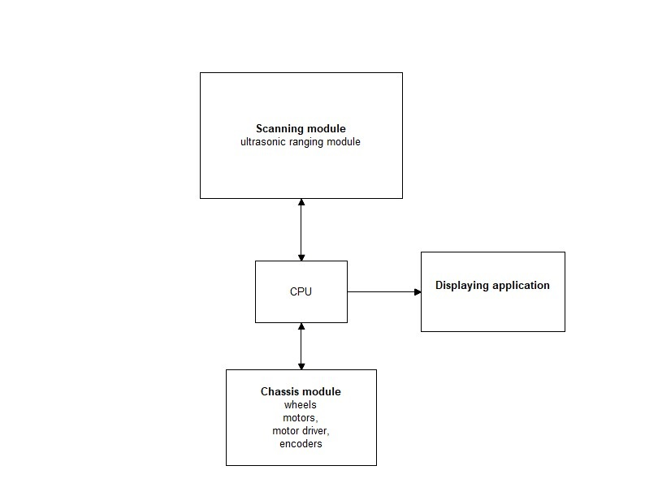

# Architecture #

### Authors ###
    * Jarosław Szumega
    * Wojciech Juszczak
    * Adam Superczyński
    
### Project description ###
The aim of this project is creating an autonomus robot which will be able to scan surrounding and detect obstacles.

### Architecture diagram ###

### Use of RTOS ###
In the project FreeRTOS will be used for following purposes:

#### Tasks ####

System will consist of two task:
1. Scanning  + servo movements
2. Robot movements

First task should be launched periodically and have higher priority than second task. After detecting obstacle close to robot it should be able to break second task. 